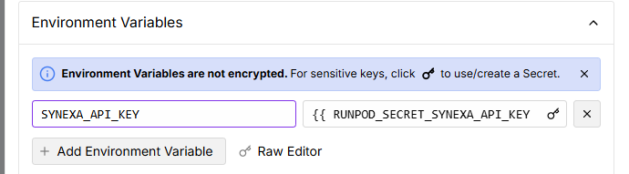

# hunyuan3d_endpoint
hunyuan3dのRunpod向けレポジトリ


## はじめに
これはRunpodの最小限のサンプルです。
このコードにより、Docker imageをサーバレスエンドポイントにデプロイすることができます。エンドポイントにリクエストが到達すると、ワーカーが起動し、rp_handler.pyに記載されているコードが実行されます。


## 実行方法
### 1. Pythonの仮想環境を作成する
python3 -m venv .venv

### 2. 仮想環境を起動する
#### On macOS/Linux:
source .venv/bin/activate

#### On Windows:
.venv\Scripts\activate

### 3. 依存関係 をインストールする
pip install -r requirements.txt

### 4. スクリプトをローカルで実行する
python3 rp_handler.py

### 5. Githubからワーカーをデプロイする
Runpod の GitHub 統合の仕組みを使用し、GithubからコードとDockerfileを取得して、コンテナイメージを構築し、Runpodのコンテナレジストリに保存して、エンドポイントにデプロイします。

詳細は[こちら](https://docs.runpod.io/serverless/workers/github-integration)

備考：
Environment Variablesで以下のように設定する（事前にSecretsへSYNEXA＿API_KEYの登録が必要）


### 6. リクエストをpodrun上で試す
PodrunのRequestタブで以下を入力して実行
```
{
  "input": {
    "image_path": "https://synexa.s3.us-east-005.backblazeb2.com/models/tencent-hunyuan3d-2-demo.png",
    "prompt": "",
    "timeout": 300
  }
}
```

### (オプション)ローカルでdockerイメージをビルドして試す
ビルド
```
docker build --platform linux/amd64 --tag kmykprn/serverless-test .
```

コンテナを立てる（ローカル実行時）
```
docker run -it --rm \
  -v $(pwd)/test_input.json:/test_input.json \
  -v $(pwd)/.env:/.env \
  kmykprn/serverless-test /bin/bash
```

環境変数を読み込む
```
source .env
```

実行する
```
python3 -u rp_handler.py
```

### 備考：ログを確認する
PodrunのLogsタブで確認する
